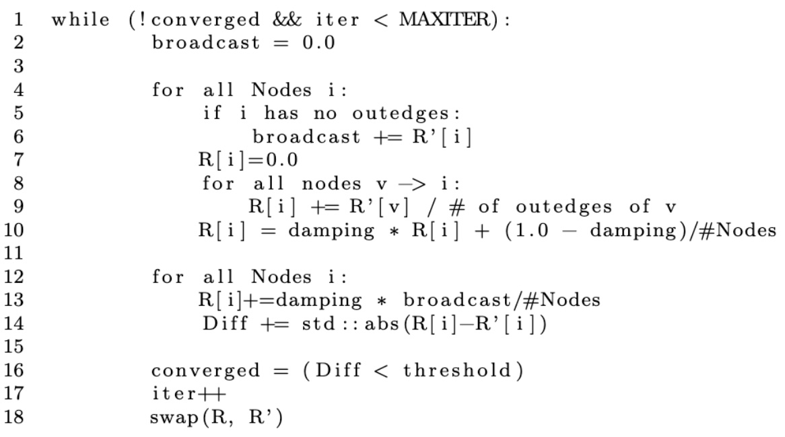

_URL_:https://fanyuex2.github.io/Parallel-Partition-Based-Pagerank/

_SUMMARY_: This project tries to parallelize pagerank algorithm in shared address space model using openMP based on graph partition. The result shows metis graph partitioning performs better, which might be due to increased locality.

# Pagerank Algorithm

- Parallelization Opportunities:
  - Within each iteration, updates of scores for all nodes can be parallelized. Work for each node should be its indegrees number of memory accesses.
- Challenges:
  - Load balancing: the degree of nodes in real life follows power law distribution
  - Locality: shared edges between partitions might contribute to bus invalidations.

# Our Approaches and Resources

- Naive: using parallel for dynamic schedule (adapted from https://github.dev/davide97l/PageRank-Parallel/blob/master/page_rank.cpp)
- Static:
  - Sort nodes based on descending indegree
  - Iterate through all nodes, assign current to the thread with minimal aggreagated indegree so far
  - Might achieve better load balancing
- Metis (https://dlasalle.github.io/mt-metis/api/index.html):
  - MtMetis graph partitioning to assign nodes to thread instead to minimize edge cut while constraining work inbalance
  - Might achieve better load (below shown undesired partition caused by static parition)
    

# Our Results

Nodes: ~917000 Edges: 5105039

Nodes: 2394385 Edges: 5021410

Nodes: 4847571 Edges: 68993773

